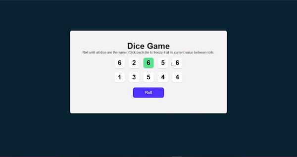

# Dice Game React.js Project

## Features

- Supports creating frontend projects using React or Vue
- Supports creating backend projects using Express.
- Allows you to select popular packages to install for each framework
- Prints helpful messages about each framework after project creation

## Installation

To install the Project Wizard, clone this repository and run `npm install` in the root directory to install the dependencies.

## Usage

To use the Project Wizard, run `node index.js` in the root directory. Follow the prompts to select your project type, framework, and packages, and the prompter will create a new project folder and install the necessary packages for you.

## Contributing

If you want to contribute to the Project Wizard, please fork this repository and create a pull request with your changes.

